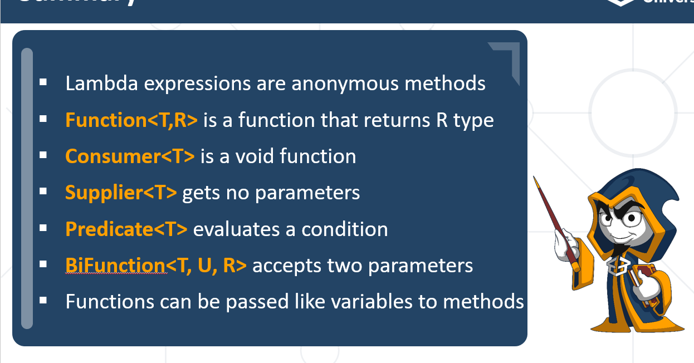

## Functional Programming 
(Functions and Lambda Expressions)

1. What is function ? 
Математическата функция ни гарантира,че за една и съща стойност на вход, 
ще получим един и същи изход. Нейната стойност не зависи от външни фактори(стойност на у)

2.Lambda Expressions - unnamed function,which have parameters and body, no name and return type

3.Functions

4. Special Functions (Consumer, Supplier, Predicate)
 - Consumer - функ. интерфейс, който ни позволява да подадем елемент, 
но да не получим изход (прилича на void method)
Приема вход, но не връща изход. Извиква се с accept()
```java
  Consumer<String> print = message -> System.out.println(message);
  print.accept("Peter");
```

- Supplier -  приема тип данни, но не връща нищо. Използва се за принтиране
- Дава ни нещо на готово
Извиква се с .get()
```java
Supplier<Integer> getRandomInt = () -> new Random().nextInt(51);
int rnd = getRandomInt.get();
```

- Predicate - приема стойност и връща boolean(true or false). Извиква се с .test
```java
Predicate<Integer> isEven = number -> number % 2 == 0;
System.out.println(isEven.test(6)); // true
```
- Function
```java
Function<Integer, Integer> increment = number -> number + 1;
int a = increment.apply(5);
int b = increment.apply(a);
```

5. Bi Functions - два входни параметъра и един за изход
```java
BiFunction<Integer, Integer, String> sum = (x, y) -> "Sum is" + (x + y); 
//BiConsumer <T, U>
// BiPredicate <T, U>
```

** полиморфизъм - когато на метод подаваме функция


        
6. UnaryOperator - приема един тип данни и връща същия тип данни
каквото приемаме, това връщаме
```java
UnaryOperator<String> unaryOperator = s -> s + "Bravo";
// UnaryOperator<Double> == Function<Double,Double> едно и също
```

- reduce - част от stream API, който ми позволява поток от ел. да го редуцирам до една крайна стойност
//   Function<List<Integer>, Integer> other = list -> list.stream().reduce(0, (fist, second) -> fist + second);


- ! ! Difference between Function And Method
accepts arguments
return or not
!! метода винаги е обвързан с някакъв клас. Методите са винаги в тялото на някои от класовете 
!! Функциите нямат имена и не са обвързани с класовете

  
- 