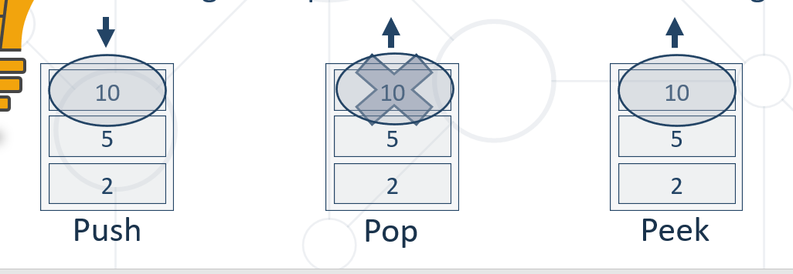

# Stack and Queue

> * Stack - Last In First Out (LIFO)

```
// creating a stack
 ArrayDeque<String> tokens = new ArrayDeque<>();
//Adding element at the top of the stack
tokens.push(element);
// Remeve the last one element and return it
tokens.pop();
// Getting the value of the topmost element
tokens.peek();
``` 


```
int size = stack.size();
boolean isEmpty = stack.isEmpty();
boolean exists = stack.contains(2);

```

> * Queue - First In First Out (FIFO)
> //Priority  Queue

        PriorityQueue<Integer> priorityQueue = new PriorityQueue<>(Comparator.reverseOrder());
        priorityQueue.offer(16);
        priorityQueue.offer(10);
        priorityQueue.offer(1);
        priorityQueue.offer(78);

        while (!priorityQueue.isEmpty()){
            System.out.println(priorityQueue.poll());
        }